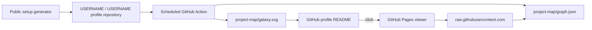

<p align="center">
  <a href="https://nekomario28.github.io/interactive-project-map/u/?username=nekomario28&style=galaxy-systems">
    
  </a>
</p>

<h1 align="center">GitHub Project Galaxy</h1>

<p align="center">
  Turn a GitHub portfolio into a static profile graphic and an interactive project map.<br/>
  <strong>One user-owned graph. Twelve visual views. No shared API call during normal viewing.</strong>
</p>

<p align="center">
  <a href="https://github.com/nekomario28/interactive-project-map/actions/workflows/ci.yml"></a>
  <a href="https://github.com/nekomario28/interactive-project-map/actions/workflows/deploy-pages.yml"></a>
  
  
  <a href="LICENSE"></a>
</p>

<p align="center">
  <a href="https://nekomario28.github.io/interactive-project-map/"><strong>Open generator</strong></a>
  &nbsp;·&nbsp;
  <a href="https://nekomario28.github.io/interactive-project-map/u/?username=nekomario28&style=galaxy-systems">Live demo</a>
  &nbsp;·&nbsp;
  <a href="#quick-start">Quick start</a>
  &nbsp;·&nbsp;
  <a href="#visual-presets">Presets</a>
  &nbsp;·&nbsp;
  <a href="CONTRIBUTING.md">Development</a>
  &nbsp;·&nbsp;
  <a href="docs/current-roadmap.md">Roadmap</a>
</p>

---

## What it does

Project Galaxy turns public GitHub repositories into a reusable portfolio graph. Your profile repository owns the generated artifacts:

```text
project-map/
├── galaxy.svg
└── graph.json
```

`galaxy.svg` is the static README image. `graph.json` drives the interactive viewers. The filename `galaxy.svg` is retained for backwards compatibility even when another visual preset is selected.

Repository status remains explicit: **Original**, **Fork**, **Archived**, and opt-in **Contributed** are not silently merged into one ownership meaning. Contributed is **off by default** and represents bounded public work in repositories owned by other people or organizations; it never means that you own those repositories.

## Quick start

1. Open the **[public generator](https://nekomario28.github.io/interactive-project-map/)**.
2. Enter your GitHub username and choose a theme, visual preset, and repository filters.
3. If `USERNAME/USERNAME` does not exist yet, use **Step 0** to create the public GitHub profile repository.
4. Use **Step 1** to copy the generated workflow and open GitHub's editor for `.github/workflows/project-map.yml`.
5. Commit the workflow, then use **Step 2** to run **Update project map** once.
6. Add the generated SVG snippet to your profile README.

No personal access token is required for the normal setup. The generated workflow uses the profile repository's GitHub token for read-only metadata generation, then a separate publish job receives the narrow write permission needed to commit the two generated files.

### Embed the generated map

```html
<p align="center">
  <a href="https://nekomario28.github.io/interactive-project-map/u/?username=USERNAME&style=galaxy-systems">
    
  </a>
</p>
```

## Visual presets

`radial` is the backwards-compatible default. Legacy `style=galaxy` aliases to `galaxy-systems`; it is not a thirteenth preset.

| Preset | Viewer route | Best for |
|---|---|---|
| `radial` | `/radial/` | compact profile README and general default |
| `galaxy-classic` | `/u/` | original one-galaxy atmosphere and global motion |
| `galaxy-systems` | `/u/` | clear category → repository spatial membership |
| `galaxy-hybrid` | `/u/` | spiral atmosphere plus readable local systems |
| `obsidian` | `/u/` | organic force-directed exploration |
| `tree` | `/tree/` | explicit Owner → Category → Repository hierarchy |
| `treemap` | `/treemap/` | dense portfolio composition |
| `timeline` | `/timeline/` | repository creation history by category |
| `cluster` | `/cluster/` | category concentration in large portfolios |
| `sunburst` | `/sunburst/` | compact proportional hierarchy |
| `matrix` | `/matrix/` | Category × Language composition |
| `sankey` | `/sankey/` | Owner → Category → repository-status flow |

All presets consume the same graph and preserve the same repository-status semantics. The Obsidian-like renderer is independently implemented and is not affiliated with or endorsed by Obsidian or Dynalist Inc.

## Architecture



The GitHub REST API is used when the user's workflow refreshes repository metadata. Normal README views and interactive-map views consume the generated static files instead of spending a shared GitHub REST quota.

The caller workflow keeps generation and publishing permissions separate:

```text
generate
  contents: read
  reusable interactive-project-map workflow
       ↓ artifact
publish
  actions: read
  contents: write
  fixed project-map output paths
```

The reusable generator never receives the caller's write-capable publish token.

## Viewer behavior

Shared Galaxy/Obsidian views support repository-status filters, Activity freshness, bounded Focus / Local Graph depth, search, shareable semantic URL state, pan/zoom/pinch, and Motion On/Off. Dedicated views use the same repository-status projection rules.

Every viewer reads:

```text
https://raw.githubusercontent.com/USERNAME/USERNAME/HEAD/project-map/graph.json
```

and applies bounded validation before rendering. Owner identity, repository URLs, labels, topics, node/edge counts, and supported edge forms are checked. Missing or invalid graphs produce setup/recovery guidance rather than silently falling back to a shared API request.

## Setup configuration

### Recommended reusable workflow

The public generator emits a caller of:

```yaml
uses: nekomario28/interactive-project-map/.github/workflows/generate-project-map.yml@v1
```

The normal reusable-workflow surface is intentionally small:

| Input | Default | Meaning |
|---|---:|---|
| `theme` | `dark` in generated setup | `dark` or `light` static SVG theme |
| `style` | `radial` in generated setup | one of the 12 visible preset IDs |
| `max_repos` | `100` | `1`–`300` eligible repositories |
| `forks` | `true` | include forks |
| `archived` | `false` | include archived repositories |
| `contributed` | `false` | include bounded public contributions owned by others without changing ownership |

The reusable workflow derives the visualized username from the caller repository owner, uses `github.token` for read-only metadata access, and writes its transfer artifact under the fixed `project-map` contract.

Stable installs use outer channel `@v1`. Advanced users may replace `v1` with a reviewed full 40-character reusable-workflow commit SHA. See [`docs/release-chain.md`](docs/release-chain.md) and [`docs/update-policy.md`](docs/update-policy.md).

### Direct Action — advanced

`action.yml` is a lower-level interface used by the reusable workflow and by advanced callers. It additionally exposes `github_token`, `username`, `width`, `height`, and `output_dir`. Do not assume those lower-level inputs are configurable through the recommended reusable-workflow setup.

See [`action.yml`](action.yml) for the exact direct-Action contract.

## Production and dormant backend boundary

The production setup path is GitHub-owned:

```text
GitHub repository + GitHub Actions + GitHub Pages
```

The retained Cloudflare Worker can support development/legacy hosted paths, while GitHub App one-click onboarding remains **DORMANT / NOT_PRODUCTION_EXPOSED**. Normal UI does not expose the one-click control. Installer activation requires the separate explicit gate plus complete credentials and the documented reviewed reactivation/acceptance conditions. Runtime secrets stay outside the public repository.

See [`docs/current-roadmap.md`](docs/current-roadmap.md), [`docs/github-only-architecture-decision.md`](docs/github-only-architecture-decision.md), and [`docs/github-app-one-click-installer.md`](docs/github-app-one-click-installer.md).

## Development

Node.js **24 is recommended** and matches CI; `package.json` currently supports Node.js `>=22.18.0`.

```bash
npm ci --ignore-scripts
npm run build:pages
npm test
```

For the full repository gate:

```bash
npm run verify
```

The current full verify path expects a Unix-like environment because Action validation uses `bash`, `curl`, `tar`, and `sha256sum` and downloads a pinned Linux x86_64 `actionlint` binary. Browser E2E is a separate rendered-behavior gate:

```bash
npm run test:e2e
npm run test:e2e:webkit
```

CI runs those suites in the pinned Playwright container. See [`CONTRIBUTING.md`](CONTRIBUTING.md) for the development loop, evidence expectations, and release boundaries.

## Project status

[`docs/current-roadmap.md`](docs/current-roadmap.md) is the canonical active-work snapshot. [`docs/research-decision-ledger.md`](docs/research-decision-ledger.md) records adopted, completed, rejected, not-planned, and dormant decisions so historical research does not become an accidental backlog.

## Contributors and research credits

Project maintainers/contributors include [Yuu / nekomario28](https://github.com/nekomario28) and [SYUN / syun88](https://github.com/syun88). GitHub's Contributors view remains commit-authorship-driven.

Public projects and papers that informed implementation choices are research references, not automatically bundled dependencies or Git co-authors. Detailed adoption and licensing boundaries are recorded in [`docs/licensing-audit-2026-08-21.md`](docs/licensing-audit-2026-08-21.md) and the corresponding research notes.

## License

MIT — copyright held collectively by the `interactive-project-map` contributors.
