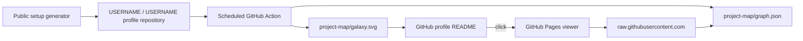

<p align="center">
  <a href="https://nekomario28.github.io/interactive-project-map/u/?username=nekomario28&style=galaxy-systems">
    
  </a>
</p>

<h1 align="center">GitHub Project Galaxy</h1>

<p align="center">
  Turn a GitHub portfolio into a static profile graphic and an interactive project map.<br/>
  <strong>One user-owned graph. Twelve visual views. No shared API call during normal viewing.</strong>
</p>

<p align="center">
  <a href="https://github.com/nekomario28/interactive-project-map/actions/workflows/ci.yml"></a>
  <a href="https://github.com/nekomario28/interactive-project-map/actions/workflows/deploy-pages.yml"></a>
  
  
  <a href="LICENSE"></a>
</p>

<p align="center">
  <a href="https://nekomario28.github.io/interactive-project-map/"><strong>Open generator</strong></a>
  &nbsp;·&nbsp;
  <a href="https://nekomario28.github.io/interactive-project-map/u/?username=nekomario28&style=galaxy-systems">Live demo</a>
  &nbsp;·&nbsp;
  <a href="#quick-start">Quick start</a>
  &nbsp;·&nbsp;
  <a href="#12-visual-presets">Presets</a>
  &nbsp;·&nbsp;
  <a href="docs/current-roadmap.md">Roadmap</a>
</p>

---

<table>
<tr>
<td width="25%" valign="top"><strong>🪐 One graph, 12 views</strong><br/><sub>Radial, three Galaxy variants, Obsidian-like, Tree, Treemap, Timeline, Cluster, Sunburst, Matrix and Sankey.</sub></td>
<td width="25%" valign="top"><strong>📦 User-owned artifacts</strong><br/><sub>Your profile repository stores <code>project-map/galaxy.svg</code> and <code>project-map/graph.json</code>.</sub></td>
<td width="25%" valign="top"><strong>⚡ Static-first</strong><br/><sub>README and viewer traffic read generated files instead of spending a shared GitHub REST quota.</sub></td>
<td width="25%" valign="top"><strong>🔎 Interactive exploration</strong><br/><sub>Search, focus, local graph depth, pan/zoom/pinch, activity overlay and repository-status filters.</sub></td>
</tr>
</table>

## What it does

Project Galaxy turns public GitHub repositories into a reusable portfolio graph. The same generated `graph.json` drives both a compact SVG for a profile README and twelve browser visualizations.

The generated data keeps repository status explicit: **Original**, **Fork**, **Archived**, and opt-in **Contributed** are never silently merged into one ownership meaning. Contributed is **off by default** and represents bounded public work in repositories owned by other people or organizations; it never means that you own those repositories. See [`docs/current-roadmap.md`](docs/current-roadmap.md) and [`docs/external-contributions-research.md`](docs/external-contributions-research.md).

## Quick start

1. Open the **[public generator](https://nekomario28.github.io/interactive-project-map/)**.
2. Enter your GitHub username and choose a theme, preset and repository filters. Enable **Include Contributed** only if you want bounded public work in repositories owned by others included; the default is off.
3. If you do not yet have the special `USERNAME/USERNAME` profile repository, use the guided **Step 0** link to create it as a public repository.
4. Use **Step 1** to copy the generated workflow and open GitHub's new-file editor at `.github/workflows/project-map.yml`.
5. Commit the workflow, then use **Step 2** to run **Update project map** once.
6. Add the generated SVG to your profile README and link it to the interactive viewer.

The first run creates:

```text
project-map/
├── galaxy.svg
└── graph.json
```

`galaxy.svg` remains the filename for backward compatibility regardless of the selected visual preset.

### Embed it in a profile README

```html
<p align="center">
  <a href="https://nekomario28.github.io/interactive-project-map/u/?username=USERNAME&style=galaxy-systems">
    
  </a>
</p>
```

## 12 visual presets

`radial` remains the backward-compatible default. The legacy `style=galaxy` value aliases to `galaxy-systems` and is intentionally not a thirteenth preset.

| Preset | Viewer route | Best for |
|---|---|---|
| `radial` | `/radial/` | compact profile README and general default |
| `galaxy-classic` | `/u/` | original one-galaxy atmosphere and global motion |
| `galaxy-systems` | `/u/` | clearest category → repository spatial membership |
| `galaxy-hybrid` | `/u/` | spiral atmosphere plus readable local systems |
| `obsidian` | `/u/` | organic force-directed exploration |
| `tree` | `/tree/` | explicit Owner → Category → Repository hierarchy |
| `treemap` | `/treemap/` | dense portfolio composition |
| `timeline` | `/timeline/` | repository creation history by category |
| `cluster` | `/cluster/` | category concentration in large portfolios |
| `sunburst` | `/sunburst/` | compact proportional hierarchy |
| `matrix` | `/matrix/` | Category × Language composition |
| `sankey` | `/sankey/` | Owner → Category → repository-status flow |

All presets consume the same graph and preserve the same repository-status semantics. Archived repositories receive an additional dashed treatment where individual repository marks are drawn.

### Galaxy Systems

Galaxy Systems is the default showcase because it makes hierarchy readable without leaving a permanent spoke network on screen. The owner is the center; categories form local systems; repositories orbit only their category. Hover/focus reveals the explanatory path when it is useful.

For static SVGs with at most 80 repositories, Galaxy Systems and Galaxy Hybrid can use script-free declarative SVG motion. Dense portfolios automatically fall back to bounded non-animated rendering.

### Obsidian-like

The Obsidian-like view is an independently implemented deterministic force-directed graph. It is not affiliated with or endorsed by Obsidian or Dynalist Inc.; Obsidian is a trademark of Dynalist Inc.

## Architecture



The GitHub REST API is used when the user's Action refreshes repository metadata. Normal README views and interactive-map views consume the generated static files instead.

The generated caller workflow also isolates permissions:

```text
generate
  contents: read
  reusable interactive-project-map workflow
       ↓ artifact
publish
  actions: read
  contents: write
  pinned GitHub-maintained Actions + fixed project-map paths
```

The reusable generator never receives the caller's write-capable publish token.

## Interactive view controls

Shared Galaxy/Obsidian views support:

- **Original / Fork / Archived** visibility controls
- **Activity** freshness overlay using the already-generated `updatedAt`
- **Focus / Local Graph** with bounded depth
- search across repository metadata and taxonomy context
- shareable semantic URL state
- Motion **ON / OFF**

Dedicated views use the same repository-status projection rules, including removal of now-empty category nodes after filtering.

## Static graph validation

Every viewer reads:

```text
https://raw.githubusercontent.com/USERNAME/USERNAME/HEAD/project-map/graph.json
```

before rendering, and applies bounded validation. Among other checks:

- the requested username must be valid
- graph owner must match that username
- repository URLs must point to the expected public GitHub repository identity
- labels, topics, node counts and edge counts are bounded
- malformed nodes/URLs and unsupported edges are discarded

If the graph is missing or invalid, the viewer shows setup/recovery guidance instead of falling back to a shared API call.

## Action inputs

| Input | Default | Meaning |
|---|---:|---|
| `github_token` | required | token used to read public GitHub metadata |
| `username` | caller owner | GitHub user to visualize |
| `theme` | `dark` | `dark` or `light` static SVG theme |
| `style` | `radial` | one of the 12 visible preset IDs; legacy `galaxy` aliases to `galaxy-systems` |
| `max_repos` | `100` | `1`–`300` eligible repositories |
| `forks` | `true` | include forks |
| `archived` | `false` | include archived repositories |
| `contributed` | `false` | include bounded public contributions to repositories owned by others; never changes repository ownership |
| `width` | `740` | SVG width, `420`–`1600` |
| `height` | `420` | SVG height, `260`–`1000` |
| `output_dir` | `project-map` | relative output directory |

Stable installs use the reusable generator channel `@v1`. Advanced users may pin a full reviewed 40-character generator commit SHA.

## GitHub Pages and dormant one-click implementation

The production setup path is GitHub-owned:

```text
GitHub repository + GitHub Actions + GitHub Pages
```

The Cloudflare Worker may still serve hosted previews/fallback, but GitHub App one-click onboarding is **DORMANT / NOT_PRODUCTION_EXPOSED**. Its small signed-state/callback implementation and security tests are retained in `main` for possible future reuse. Normal UI does not show the one-click control, and installer routes fail closed unless the separate explicit `ENABLE_ONE_CLICK_INSTALLER=true` gate and complete credentials are both present. The gate stays off unless concrete onboarding evidence or an explicit reviewed product decision justifies reactivation and the documented real-credential acceptance is then completed. Runtime secrets stay outside the public repository. See [`docs/current-roadmap.md`](docs/current-roadmap.md), [`docs/github-only-architecture-decision.md`](docs/github-only-architecture-decision.md) and [`docs/github-app-one-click-installer.md`](docs/github-app-one-click-installer.md).

## Development

```bash
npm ci --ignore-scripts
npm run build:pages
npm run verify
```

Verification includes TypeScript checking, Wrangler dry-run, Node syntax checks, HTML validation, ESLint, Stylelint, actionlint, static graph validation, permission-isolation tests, dense 300-repository regressions, and renderer-specific gates across all twelve presets.

CI also renders all twelve presets from the same graph and uploads a visual comparison artifact on relevant changes.

## Project status

The current roadmap, completed Contributed production proof, and remaining product/operations work are tracked in [`docs/current-roadmap.md`](docs/current-roadmap.md).

## Contributors & credits

### Project contributors

<table>
<tr>
<td align="center" width="180">
<a href="https://github.com/nekomario28"><br/><sub><b>Yuu / nekomario28</b></sub></a><br/><sub>Maintainer · implementation</sub>
</td>
<td align="center" width="180">
<a href="https://github.com/syun88"><br/><sub><b>SYUN / syun88</b></sub></a><br/><sub>Project contributor</sub>
</td>
</tr>
</table>

GitHub's automatic **Contributors** view remains commit-authorship-driven. Research credits acknowledge public work that informed design decisions; they are not presented as Git co-authors or bundled dependencies.

<details>
<summary><b>Research & upstream credits</b></summary>

<br/>
<table>
<tr>
<td align="center" valign="top" width="25%"><a href="https://github.com/tjqscott/obsidian-graph-spawn"><br/><sub><b>Graph Spawn</b></sub></a><br/><sub>spawn lifecycle · MIT</sub></td>
<td align="center" valign="top" width="25%"><a href="https://github.com/Sanqui/obsidian-persistent-graph"><br/><sub><b>Persistent Graph</b></sub></a><br/><sub>simulation lifecycle · MIT</sub></td>
<td align="center" valign="top" width="25%"><a href="https://github.com/CalfMoon/node-factor"><br/><sub><b>Node Factor</b></sub></a><br/><sub>connectivity sizing · MIT</sub></td>
<td align="center" valign="top" width="25%"><a href="https://github.com/d3/d3-force"><br/><sub><b>d3-force</b></sub></a><br/><sub>force behavior reference · ISC</sub></td>
</tr>
<tr>
<td align="center" valign="top"><a href="https://github.com/jacomyal/sigma.js"><br/><sub><b>Sigma.js</b></sub></a><br/><sub>label density / LOD · MIT</sub></td>
<td align="center" valign="top"><a href="https://github.com/microsoft/msagljs"><br/><sub><b>MSAGLJS</b></sub></a><br/><sub>semantic zoom · MIT</sub></td>
<td align="center" valign="top"><a href="https://github.com/cytoscape/cytoscape.js"><br/><sub><b>Cytoscape.js</b></sub></a><br/><sub>label visibility threshold · MIT</sub></td>
<td align="center" valign="top"><a href="https://github.com/maplibre/maplibre-gl-js"><br/><sub><b>MapLibre GL JS</b></sub></a><br/><sub>scale / collision policy · BSD-3-Clause</sub></td>
</tr>
<tr>
<td align="center" valign="top"><a href="https://github.com/Stellarium/stellarium"><br/><sub><b>Stellarium</b></sub></a><br/><sub>FOV label disclosure · GPL-2.0 concept only</sub></td>
<td align="center" valign="top"><a href="https://github.com/kenforthewin/atomic"><br/><sub><b>Atomic</b></sub></a><br/><sub>semantic-unit model · MIT</sub></td>
<td align="center" valign="top"><a href="https://github.com/juanceresa/sift-kg"><br/><sub><b>sift-kg</b></sub></a><br/><sub>schema discovery · MIT</sub></td>
<td align="center" valign="top"><a href="https://github.com/microsoft/graphrag"><br/><sub><b>GraphRAG</b></sub></a><br/><sub>hierarchical community reference · MIT</sub></td>
</tr>
</table>

Detailed adoption and licensing boundaries are recorded in [`docs/licensing-audit-2026-08-21.md`](docs/licensing-audit-2026-08-21.md) and the corresponding research notes.

</details>

## License

MIT — copyright held collectively by the `interactive-project-map` contributors.
