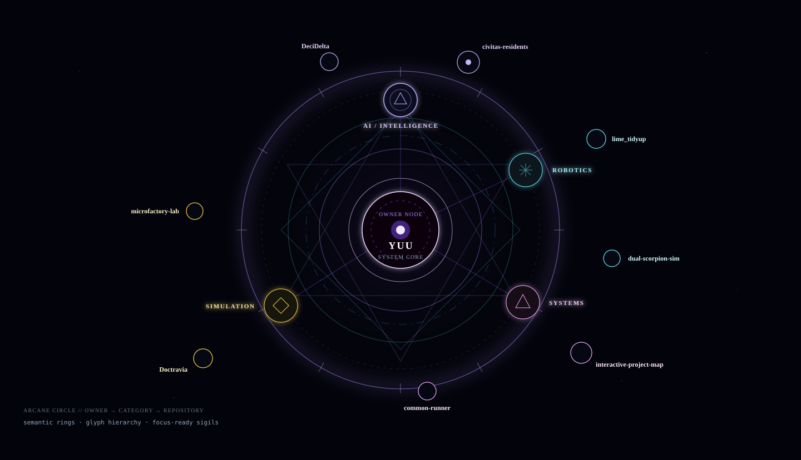
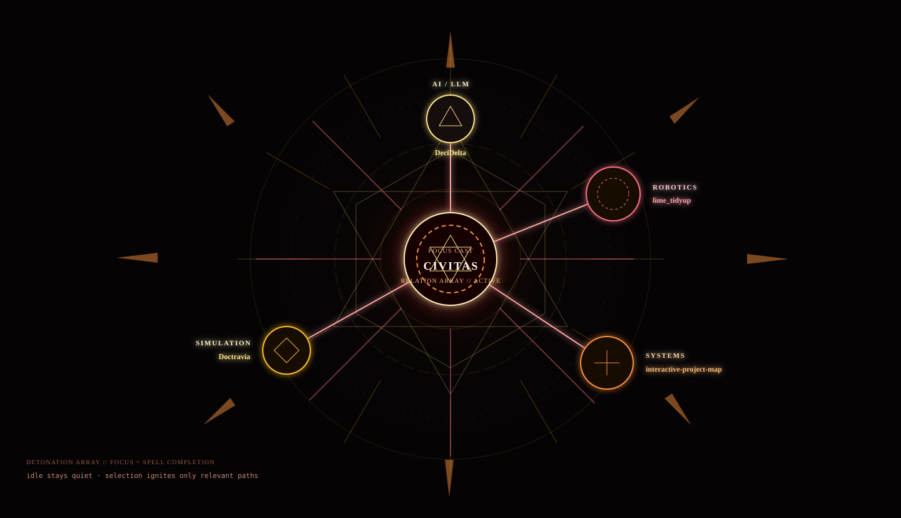
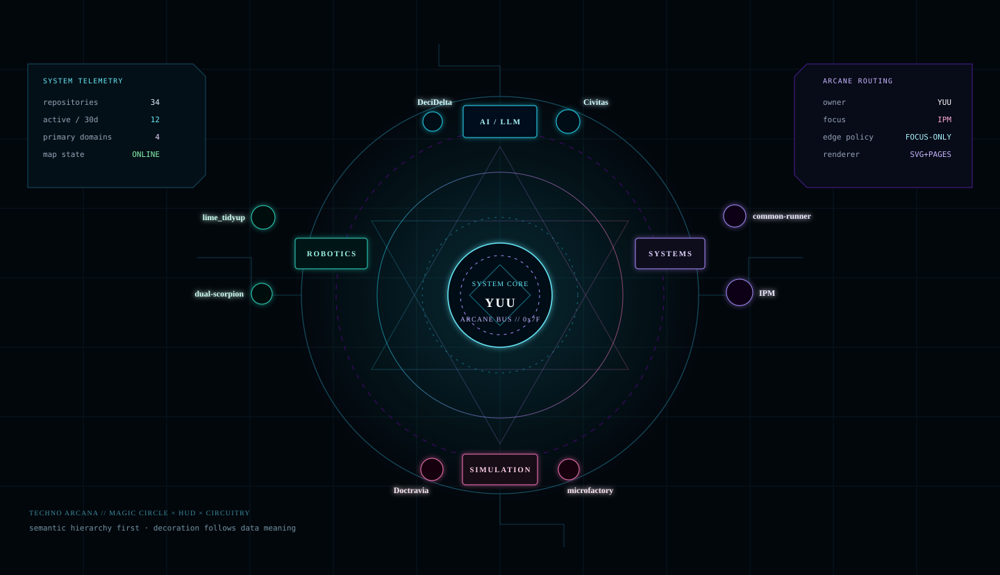
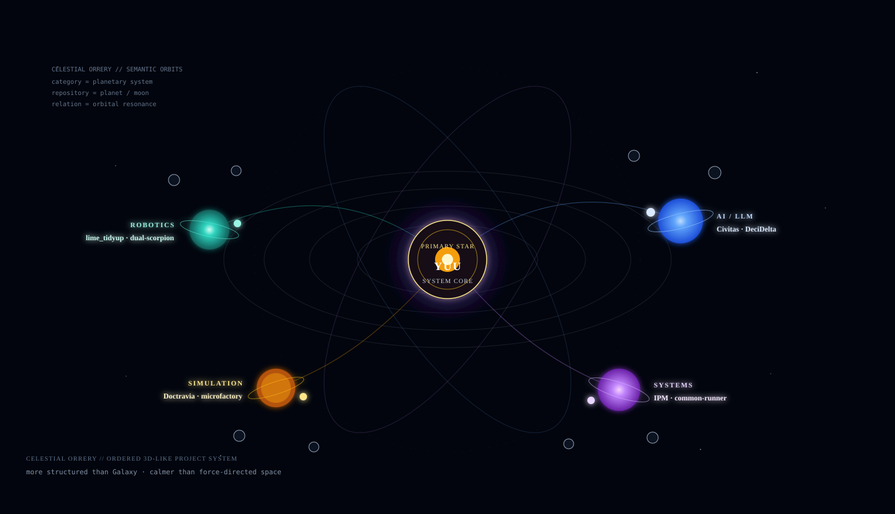

# Arcane IPM style prototypes

Experimental-only visual study. These files are intentionally not wired into the production preset registry yet.

The four prototypes use the same conceptual hierarchy (`Owner → Category → Repository`) so the visual languages can be compared before implementation work begins.

## Arcane Circle

Magic-circle semantics: owner core, category sigils, repository outer ring.

## Detonation Array

Focus-state concept: selecting a repository completes and ignites only its relevant relation array.

## Techno Arcana

Magic circle × SF HUD × circuitry. Intended as the strongest candidate for a readable production preset.

## Celestial Orrery

Ordered pseudo-3D orbital layout: category = planetary system, repositories = planets/moons.

## Prototype boundary

- No production preset IDs added yet.
- No `graph.json` schema change.
- No existing Galaxy / Obsidian runtime changes.
- Static SVG only for this comparison pass.
- Next gate, if selected: drive each renderer from the same real `graph.json`, then test dense 100/300-repository layouts and interactive focus behavior.
